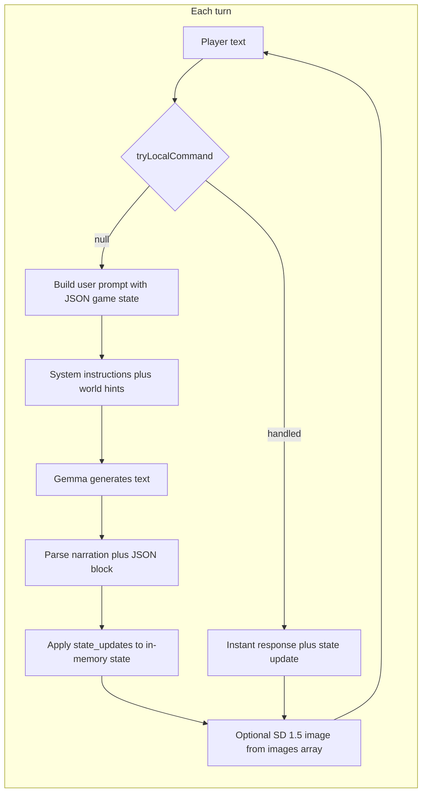
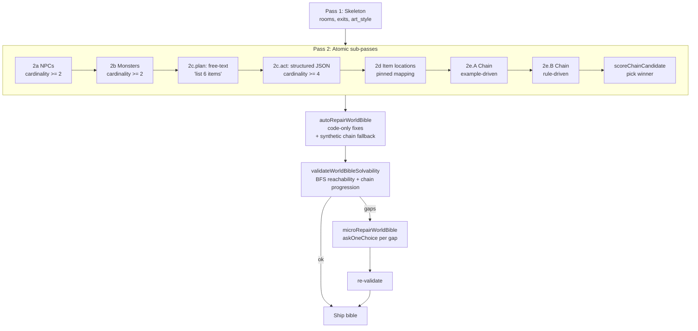

# JMR's LLM Adventure — browser edition

In-browser text adventure: **Gemma 4B** (Transformers.js) narrates and runs game logic; **Stable Diffusion 1.5** draws scenes. Same design idea as the Python engine in [Collosol-Cave-with-local-LLM](https://github.com/jmrothberg/Collosol-Cave-with-local-LLM/tree/main/llm_adventure).

| File | Role |
|------|------|
| [`adventure.html`](adventure.html) | Full game UI + engine |
| This README | Setup, generation, save/load, JSON behavior |

---

## Quick start (GitHub Pages — recommended)

**No install.** Use a recent **Chrome or Edge** with **WebGPU** if you can (first visit downloads ~5 GB of models from HuggingFace, then caches them).

| Link | Notes |
|------|--------|
| **[Play (full URL)](https://jmrothberg.github.io/JMR-LLM-Adventure/browser_adventure/adventure.html)** | Main entry point |
| **[Short redirect](https://jmrothberg.github.io/JMR-LLM-Adventure/adventure.html)** | Repo-root stub → same game |

GitHub Pages serves the **whole repository**, so `adventure.html` can load `../vendor/web-txt2img/` correctly. You do **not** need a local Python server just to play the hosted build.

**Link previews** (Slack, Discord, iMessage): Open Graph / Twitter tags point at [`og-preview.png`](og-preview.png). Crawlers cache; refresh with [Facebook Sharing Debugger](https://developers.facebook.com/tools/debug/) if needed.

---

## Local development server (optional, faster COOP/COEP)

For hacking on the repo locally, serve from the **repository root**, not from `browser_adventure/` alone — the page loads workers from **`../vendor/web-txt2img/`**.

**Finding the script:** `python3 scripts/serve-threaded.py` only works if your shell is already in the repo root; otherwise use the full path to `scripts/serve-threaded.py`.

**Files served:** The dev server always serves from the **repository root** (the folder that contains `browser_adventure/`), even if you start Python from home (`~`). You should see `Root: …/JMR-LLM-Adventure` in the terminal when it starts.

```bash
cd /path/to/JMR-LLM-Adventure   # repo root
python3 scripts/serve-threaded.py 8080
# Open http://localhost:8080/browser_adventure/adventure.html
```

From any directory (absolute path to the script):

```bash
python3 /path/to/JMR-LLM-Adventure/scripts/serve-threaded.py 8080
```

> **Why not `python3 -m http.server`?** The default module does not send `Cross-Origin-Opener-Policy` / `Cross-Origin-Embedder-Policy`, so the page may not get `crossOriginIsolated` and ONNX can fall back to slower single-threaded WASM.

A redirect stub lives at [`adventure.html`](adventure.html) at the repo root.

---

## Models — internet vs. local

### Two ways to run (LLM, SD, and Kokoro TTS)

| Mode | Start | First run | After setup / first visit |
|------|-------|-----------|---------------------------|
| **A — Local offline** | `./scripts/setup_local.sh` then `python3 scripts/serve-threaded.py` | Downloads ~5.2 GB to `local_models/` | **Fully offline** on localhost |
| **B — GitHub Pages** | [Play in browser](https://jmrothberg.github.io/JMR-LLM-Adventure/browser_adventure/adventure.html) | Browser downloads from HuggingFace | **Cached in-browser** inference; **Narration** toggle for Kokoro |

```bash
./scripts/setup_local.sh          # Mode A — one-time download
python3 scripts/serve-threaded.py # then serve locally
```

### Default: just open the page (Mode B — internet required first time)

Most users don't need to download anything manually. Open the GitHub Pages link (or serve locally) and the browser fetches models from HuggingFace Hub on first load, then caches them:

| Model | Source | Size | Purpose |
|-------|--------|------|---------|
| **Gemma 4 E4B** (ONNX q4) | `onnx-community/gemma-4-E4B-it-ONNX` | ~3.1 GB | Text generation (narrator + game master) |
| **SD 1.5** (MS WebNN ONNX fp16) | `microsoft/stable-diffusion-v1.5-webnn` | ~1.9 GB | Scene illustration |
| **CLIP tokenizer** | `Xenova/clip-vit-base-patch16` | ~2 MB | Prompt encoding for SD 1.5 |
| **Kokoro 82M TTS** (ONNX q8) | `onnx-community/Kokoro-82M-v1.0-ONNX` | ~86 MB | Optional narrator speech (header toggle) |

First load is **~5.1 GB** total (browser-cached afterward). **WebGPU** (Chrome/Edge 113+) is strongly recommended for Gemma/SD; Kokoro TTS uses **WASM/CPU** only.

### Optional: fully offline / local files

For faster loading or air-gapped machines, download the model files once to `local_models/` in the repo root. The game auto-detects each model independently on localhost — you can have the LLM local and SD remote, or both local.

**Prerequisite:** `pip install huggingface_hub` (one time).

```bash
./scripts/setup_local.sh
# or: python3 scripts/download_models.py
# TTS only: python3 scripts/download_models.py --only kokoro
```

Manual download (same files):

```bash
cd /path/to/JMR-LLM-Adventure
python3 -c "
from huggingface_hub import snapshot_download
# Gemma 4 E4B ONNX (q4) — ~3.1 GB
snapshot_download('onnx-community/gemma-4-E4B-it-ONNX',
    allow_patterns=['config.json','generation_config.json','tokenizer.json',
        'tokenizer_config.json','preprocessor_config.json','processor_config.json',
        'chat_template.jinja',
        'onnx/decoder_model_merged_q4.onnx','onnx/decoder_model_merged_q4.onnx_data',
        'onnx/decoder_model_merged_q4.onnx_data_1'],
    local_dir='local_models/onnx-community/gemma-4-E4B-it-ONNX')
# SD 1.5 ONNX (fp16) — ~1.9 GB
snapshot_download('microsoft/stable-diffusion-v1.5-webnn',
    allow_patterns=['text-encoder.onnx',
        'sd-unet-v1.5-model-b2c4h64w64s77-float16-compute-and-inputs-layernorm.onnx',
        'Stable-Diffusion-v1.5-vae-decoder-float16-fp32-instancenorm.onnx'],
    local_dir='local_models/microsoft/stable-diffusion-v1.5-webnn')
# CLIP tokenizer (used by SD 1.5) — ~2 MB
snapshot_download('Xenova/clip-vit-base-patch16',
    allow_patterns=['tokenizer.json','tokenizer_config.json','config.json'],
    local_dir='local_models/Xenova/clip-vit-base-patch16')
# Kokoro 82M TTS — ~86 MB
snapshot_download('onnx-community/Kokoro-82M-v1.0-ONNX',
    allow_patterns=['config.json','onnx/*.onnx','onnx/*.onnx_data*','voices/af_heart.bin'],
    local_dir='local_models/onnx-community/Kokoro-82M-v1.0-ONNX')
"
```

Total: **~5.2 GB**. The `local_models/` directory is git-ignored.

**TTS spike:** `browser_adventure/tts_test.html` — standalone Kokoro vs Web Speech test (serve via `python3 scripts/serve-threaded.py`).

When serving from localhost, the game probes for each model's files at startup and reports what it found (e.g. "Local model files detected (LLM + SD 1.5 + Kokoro TTS)").

---

## What “generates” the story?

The story is **not** a fixed script. Each beat is produced by a **text-generation model** (Gemma 4 E4B ONNX) acting as **narrator + game master**. The page does not run a hand-authored plot tree; it runs a **loop**:



**Fast-path commands** (no LLM call — check Debug for `route: fast_path`):

| Command | Examples |
|---------|----------|
| Look | `look`, `l`, `look around` |
| Inventory | `inv`, `i`, `inventory` |
| Map | `map`, `m` |
| Move | `go north`, `enter Dark Passage`, `n`/`s`/`e`/`w`/`u`/`d` |
| Take / drop | `take rope`, `get the key`, `pick up flint`, `drop torch` |
| Examine | `examine troll`, `x rope`, `look at hermit` |
| Wait / help | `wait`, `help`, `?` |
| Combat / puzzles | `attack dragon`, `use flint on forge`, `solve`, `answer …` — only when the engine can match world-bible mechanics unambiguously; otherwise falls through to Gemma |

Multi-item lists work: `take the key, lantern and staff`. Item matching tolerates articles and snake_case (`take key` → `runic_key`).

1. **Your input** is first checked against **`tryLocalCommand()`**. Common adventure verbs update state instantly (~60% of typical exploration turns).
2. If not handled locally, input is appended to a **structured snapshot** of the game (location, inventory, map, flags, notes, recent dialogue).
3. The model receives **system instructions** that tell it exactly how to format its reply: prose first, then a fenced ` ```json ` block with `state_updates` and `images`.
4. JavaScript **strips** the JSON from what you read and **applies** the directives (move, connect rooms, items, health, flags, etc.).
5. **Images** are separate: the first image prompt (plus a fixed art-style suffix) is sent to **Stable Diffusion 1.5** in a Web Worker. Room images are **cached in memory** (blob URLs) so revisiting a room does not always re-render.

So: **the LLM invents the wording and proposes state changes**; **the engine enforces structure** by parsing JSON and updating a single canonical `GameState` object.

---

## Two layers of “story logic”

### 1. World Bible (static, embedded in `adventure.html`)

Near the top of the script section, the object **`DEFAULT_WORLD_BIBLE`** is a **design document**: objectives, locations, NPCs, monsters, riddles, key items, item locations, progression hints, mechanics, win condition, and a global image theme string.

- The LLM **does not** have to follow it literally every turn, but **`buildUserPrompt()`** injects **excerpts** relevant to the **current room** (NPCs here, monsters here, puzzles here, hints, current objective, etc.).
- That steers tone, consistency, and puzzle structure without hard-coding dialogue trees.

Changing this object is the main way to get a **different setting** without rewriting the whole engine.

### 2. System instructions (behavior contract)

The string **`SYSTEM_INSTRUCTIONS`** tells the model:

- Write **2–5 sentences** of visible narration.
- Then output **one JSON object** (in ` ```json ` fences) with:
  - **`state_updates`**: tools like `move_to`, `connect`, `place_items`, `room_take`, `add_items`, `remove_items`, `change_health`, `set_context`, `set_flag`, `add_note`.
  - **`images`**: at least one short **English** visual description for the scene (used as an SD prompt fragment).

The engine **only** changes inventory, map, health, etc. when those fields appear in parsed JSON. If the model forgets JSON or breaks syntax, you may get **narration-only** turns (see Debug panel) with little or no state change.

---

## Opening scene vs. later turns

- **Start:** `startStory()` sends a **kickoff** user message: start a new adventure, describe the opening, set a location with exits, place a starter item, include an image prompt. It also prepends a **compact summary** derived from `DEFAULT_WORLD_BIBLE` (objectives, NPCs, sample locations).
- **Later turns:** `buildUserPrompt()` sends the **live JSON state** plus **room-specific world bible lines** plus `Player says: …`.

Temperature and `max_new_tokens` are set in `adventure.html` (defaults: creative enough for variety, bounded enough for JSON).

---

## How to create a custom story (practical guide)

All edits are in **[`adventure.html`](adventure.html)** (search within the file).

### A. New setting, same mechanics

1. Replace or edit **`DEFAULT_WORLD_BIBLE`**:
   - **`locations`**: names + short descriptions (used for hints and win heuristics).
   - **`npcs`**, **`monsters`**, **`riddles`**, **`key_items`**, **`item_locations`**, **`objectives`**, **`win_condition`**, **`progression_hints`**, **`mechanics`**.
2. Set **`global_theme`** / **`theme`** to a string that describes art direction; **`IMAGE_THEME`** is also appended to SD prompts—keep them aligned for consistent pictures.
3. Optionally adjust **`SYSTEM_INSTRUCTIONS`** examples so they match your genre (e.g. sci-fi room names instead of caves).

### B. Stricter or looser narrator behavior

- Tweak **`SYSTEM_INSTRUCTIONS`**: length of narration, required JSON keys, emphasis on `room_take` vs `add_items`, etc.
- Adjust **`LLM_TEMPERATURE`** and **`LLM_MAX_TOKENS`**: higher temperature = more variety, more risk of invalid JSON; lower = more repetitive, often cleaner JSON.

### C. Different default opening

Edit the **`kickoff`** string inside **`startStory()`** (what the model sees for the very first generation).

### D. Image look

- **`IMAGE_THEME`**: appended to every SD prompt.
- **`IMG_STEPS`** / **`IMG_GUIDANCE`**: quality vs. speed (SD 1.5).

### E. Different LLM or image model

- **`LLM_MODEL_ID`**: any Transformers.js ONNX chat model you have tested (this project defaults to Gemma 4 E4B).
- **`IMG_MODEL_ID`**: wired to `web-txt2img` registry (default `sd-1.5`). Changing this may require different `generate()` parameters—see the compare demo in [Collosol-Cave-with-local-LLM](https://github.com/jmrothberg/Collosol-Cave-with-local-LLM/blob/main/llm_adventure/diffusers-webgpu-compare-test.html).

---

## JSON directives reference (browser subset)

| Key | Meaning |
|-----|--------|
| `move_to` | Player location (string). |
| `connect` | `[[roomA, roomB], …]` bidirectional exits. |
| `place_items` | Items added to **current** room. |
| `room_take` | Pick up from room → inventory (preferred over abusing `add_items`). |
| `add_items` / `remove_items` | Direct inventory changes; overlap is treated like a mistaken `room_take`. |
| `change_health` | Integer delta. |
| `set_context` | LLM “memory” string stored in state. |
| `set_flag` | `{ name, value }` in `game_flags`. |
| `add_note` | Quest log line. |
| `images` | String array; first entry drives SD when a new room image is needed. |

Win detection uses **`win_condition`** text plus **`game_flags`** / inventory heuristics (see `checkWinCondition` in the script).

---

## Adventure picker: default, generate, load

Before **Start Adventure**, pick one card:

| Card | What you get |
|------|----------------|
| **Default Cave Adventure** | Built-in world (Starfire Gem / Cave Mouth, etc.). No LLM world build. |
| **Generate New Adventure** | Two-pass LLM build from your theme (preset dropdown or custom text). |
| **Load Saved Adventure** | Browser **Save game** slots, or **import JSON** (world bible or full save). |

**Important:** To get a **new** Tolkien/Zork/etc. world, choose **Generate New Adventure** (card must be selected), enter or pick a theme, then **Start**. If you only see the default cave, you either picked **Default Cave** or generation failed (see Debug).

---

## World bible generation (Gemma vs Ollama)

**Generate New Adventure** can build the world bible two ways:

1. **In-browser Gemma** (checkbox **off**) — same model as gameplay; often 30–90s; can be weaker at JSON.
2. **Local Ollama** (checkbox **on**) — your Mac/PC runs the map + content passes; gameplay still uses Gemma in the browser.

After a successful **Ollama** build, a **`world_bible_*.json`** is saved to your **Downloads** folder (same idea as **Export World**).

### Ollama setup (short checklist)

1. **Install Ollama** on the same machine as the browser — [ollama.com](https://ollama.com).
2. **Pull a model:** `ollama pull gemma4:12b` (or any model you like). Use the **exact** name from `ollama list` in the game UI.
3. **Start Ollama with CORS enabled.** The game’s browser tab needs permission to call `http://127.0.0.1:11434`. Open a terminal and run:

   ```bash
   OLLAMA_ORIGINS="https://jmrothberg.github.io,http://localhost:*,http://127.0.0.1:*" ollama serve
   ```

   **That’s it.** Works on Mac, Linux, and WSL. Covers both GitHub Pages and local use. The setting is temporary — it only lasts while the terminal is open and does not change any system config.

   > **If you see `address already in use`:** the Mac Ollama desktop app (or another `ollama serve`) is already running. Quit it first (menu-bar llama icon → Quit Ollama), then run the command above. For forks replace `jmrothberg` with your GitHub username.

4. Status lines under the progress bar show **`[Ollama · model]`** vs **`[Gemma world-gen]`** so you always see which backend is generating.

### Ollama troubleshooting (Debug panel)

Open **Debug** after a failed or odd run:

- **`[Ollama API]`** — HTTP status, `format=json`, `num_predict`, **`done_reason=length`** (hit token cap), and raw JSON when needed.
- **`FAILURE:`** — first explanation when generation falls back to the built-in cave.
- **`active: generation failed → built-in default`** — read **`FAILURE:`** and **`[Ollama API]`** lines right below the header.

Empty replies trigger retries (single user message, then `/api/generate`). Pass 1 uses **JSON mode** and **larger `num_predict`** than the old 800-token cap so map JSON is not truncated as often.

---

## Agent loop: making 4B Gemma generate real games

The browser engine generates a complete, solvable adventure with **only Gemma 4 E4B** (no remote API, no Ollama needed). It does this by **acting as an agent**: the JavaScript orchestrator decomposes the hard "design a 12-field cross-referenced game" task into many small narrow tasks the 4B model can actually solve, scores results, decides what to do next, and falls back to deterministic code when the model can't help.

Standalone single-shot generation reliably produced 0-NPC / 0-chain / empty-purpose JSON on Gemma 4 E4B (small models choke on 11-field cross-referenced output — the `MAKING_ADVENTURES_GREAT_WITH_SMALL_MODELS.md` playbook documents this). The agent below turns that around.



**Key principles** (from agent literature: Plan-and-Execute, Best-of-N voting, Self-Refine):

| Layer | Technique | Why it works on a 4B model |
|---|---|---|
| Decomposition | Atomic sub-passes (one field per LLM call) | Small models excel at narrow jobs and choke on 11-field JSON. |
| Pinning | Skeleton names passed as **literal JSON arrays** in every prompt | Gemma copies pinned tokens accurately; can't drift to invented names. |
| Plan-then-act | `planItemNames` does free-text "list 6 items"; `runAtomicPass` does structured JSON with planned names pinned in | Gemma is dramatically better at lists than at structured JSON; using both phases plays to its strength. |
| Best-of-N | `2e` chain pass runs **two candidates** with different framings (example-driven vs rule-driven), `scoreChainCandidate` picks the winner | One bad chain ruins the game; doubling the chain budget is the right tradeoff. |
| Tolerant extraction | `runAtomicPass.normalize` accepts `{field:[...]}` OR bare `[...]` OR alias keys | Gemma sometimes drops the wrapper; we don't lose data over formatting. |
| Cardinality validation | Per-sub-pass `minItems` check; one stricter retry; partial-accept fallback | Better to ship 4 items than 0. |
| Code-only auto-repair | `autoRepairWorldBible` snaps locations to real rooms, places orphan items, clears phantom `gives`, **builds a synthetic chain** if Gemma's chain is empty | Mechanical fixes never need an LLM round-trip; the synthetic chain is the floor — you ALWAYS get a playable game. |
| Solvability validator | `validateWorldBibleSolvability` does BFS from start, checks chain progression (last step in last room with `unlocks="win"`) | Catches what auto-repair missed; reports actionable gaps. |
| LLM micro-repair | `microRepairWorldBible` asks Gemma single multiple-choice questions ("Which item is X's weakness? Options: …") | Multiple-choice from a fixed list is the format small models are happiest with. |

**Visible agent reasoning** — every orchestration decision logs an `agent:` line in the Debug panel:

```
agent: planItemNames produced 6 candidate(s): silver lantern, …
atomic key_items: parsed ok (6 key_items)
atomic puzzle_chain.A: parsed ok (7 puzzle_chain)
atomic puzzle_chain.B: parsed ok (5 puzzle_chain)
agent: chain candidate A=7 steps score=42; B=5 steps score=28
agent: picked chain candidate A (7 steps)
auto-repair: 2 fix(es) applied
solvability: OK (7 rooms, 6 items, 7 chain steps, all reachable)
```

**Toggles** (top of `adventure.html`):

| Flag | Default | Purpose |
|---|---|---|
| `USE_ATOMIC_PASS2` | `true` | Master switch for the agent loop. Set `false` to revert to legacy single-shot Pass 2 for comparison. |

The Python sibling `LMM_adventure_May_2_2026.py` runs the same patterns at 27–35B-class scale; this is the same playbook scaled down to a 4B browser model. The patterns scale **down** better than they scale up — every layer of structure becomes more valuable as the model gets smaller.

---

## Save / load / export

- **Save game** (header): world bible + progress → this browser’s `localStorage` only.
- **Export World**: downloads **world bible JSON** only (no inventory). Good for sharing or editing.
- **Import JSON**: world bible like [`default_cave.json`](default_cave.json), or a full save with `gameState`.
- **New Adventure**: returns to the picker (models stay cached if already loaded).

The live setting is **`activeWorldBible`** (starts as **`DEFAULT_WORLD_BIBLE`** in `adventure.html`).

---

## Help, hints, and solvability

**Fast local commands (no LLM):** **`look`**, **`inventory`** / **`inv`**, **`map`**. Everything else—including **`help`**, **`hint`**, goals, strategy, or “what should I do”—goes through the **narrator LLM** in one turn.

**Normal play (lean prompt):** The model gets **current state JSON** plus **this room’s** bible cues (description, NPCs, monsters, blockers, items tied to this room). It does **not** get a scripted “next puzzle step” line every turn; pacing and hint strength are up to the model.

**Meta-help (richer prompt, same single call):** If the input looks like meta help (e.g. starts with **`help`**, **`hint`**, **`stuck`**, **`goals`**, **`how do i win`**, **`what should i do`**, **`walkthrough`**, **`any hints`**—see `playerWantsMetaHelp` in `adventure.html`), the user prompt also includes **`FULL_WORLD_BIBLE_JSON`**: the **entire** world bible so the LLM can answer from the full design. System instructions tell it to use **discretion** (nudge vs detailed plan) and not dump raw JSON unless the player asks.

**Generation:** Pass 2 is instructed to keep **`puzzle_chain`** **logically solvable** and consistent with items/NPCs/rooms, and to write **`author_walkthrough`** aligned with that chain. If the model omits it, the engine **synthesizes** a walkthrough from structured fields.

**Full written solution (debug only):** Open **Debug**, expand the world bible block, then **“Designer walkthrough (full spoiler — debug only)”**. There is **no** in-game cheat phrase.

**Export World** includes **`author_walkthrough`** in the JSON for offline reading or editing.

## Running tests

Deterministic world-bible logic (validation, auto-repair, solvability, JSON extraction) lives in [`world_bible_logic.mjs`](world_bible_logic.mjs). Tests are in [`world_bible_tests.mjs`](world_bible_tests.mjs).

**In the game (GitHub Pages or local):** expand **Debug**, click **Run tests**. This runs:

1. **Regression** — golden fixture [`default_cave.json`](default_cave.json) plus inline edge cases (empty chain, bad JSON, orphan rooms).
2. **Live** — `validateWorldBible` + `validateWorldBibleSolvability` on the **current** `activeWorldBible` (the adventure you just generated or loaded).

Results append to the debug panel. Use **Copy debug** to paste the full log when reporting issues.

**From the repo (contributors / CI):**

```bash
node --test browser_adventure/tests/world_bible_logic.test.mjs
```

No npm install, GPU, or Ollama required. These tests do **not** re-run LLM generation—they only exercise the code that makes generated adventures winnable.

---

## What the Python game has that the browser build does not

The browser page is intentionally smaller in a few areas:

- No **MFLUX** / local FLUX paths; images are **only** SD 1.5 via ONNX in the worker.
- **Advanced directives** from the Python engine (timers, chain reactions, etc.) are not implemented in the browser `applyLlmDirectives`—only the table above.
- Per-turn play uses **fast-path commands** for movement, inventory, look/map, and unambiguous mechanics; everything else is narrator-style prose+JSON via Gemma. See [What generates the story](#what-generates-the-story) above.

World-bible **generation** parity is now close: the [agent loop](#agent-loop-making-4b-gemma-generate-real-games) above ports the Python sibling's structural strategy (decomposition, plan-then-act, best-of-N, auto-repair, solvability validator, micro-repair) down to standalone 4B Gemma. Ollama remains supported for users who want a heavier remote model to author the bible, but it is no longer required for a real, solvable game.

For full feature parity (advanced directives, Apple-Silicon-class models, FLUX images), see the Python engine in [Collosol-Cave-with-local-LLM/llm_adventure](https://github.com/jmrothberg/Collosol-Cave-with-local-LLM/tree/main/llm_adventure).

---

## Dependencies (all loaded automatically)

- **Gemma 4 E4B** — ONNX q4, loaded via [`@huggingface/transformers`](https://huggingface.co/docs/transformers.js) (3.1 GB).
- **SD 1.5** — Microsoft WebNN ONNX fp16, loaded via **`vendor/web-txt2img/`** (1.9 GB).
- **CLIP tokenizer** — used by SD 1.5 for prompt encoding (2 MB).
- **Kokoro 82M TTS** — ONNX q8 via [`kokoro-js`](https://www.npmjs.com/package/kokoro-js), WASM/CPU narrator (`af_heart` voice); toggle in header; Web Speech fallback if load fails (~86 MB).

See [Models — internet vs. local](#models--internet-vs-local) above for download details and sizes.

---

## More documentation

- Python engine source (full prompts, validation, image pipeline): [Collosol-Cave-with-local-LLM/llm_adventure](https://github.com/jmrothberg/Collosol-Cave-with-local-LLM/tree/main/llm_adventure)
